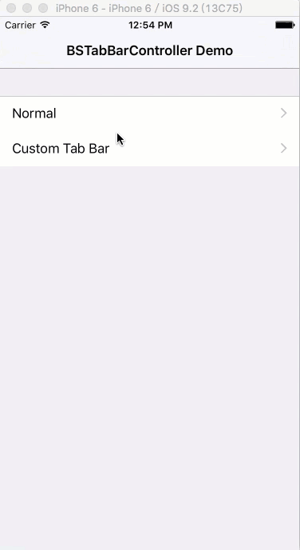
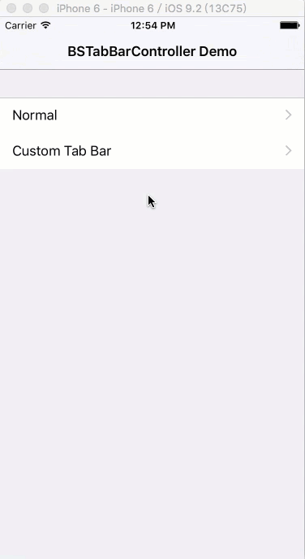

# BSTabBarController

A custom tab bar controller for iOS.

## Installation

Available in [CocoaPods](http://cocoapods.org/?q= BSTabBarController)

```
pod 'BSTabBarController'
```

or

1. Copy `BSTabBarController` folder to your project;
2. Install 'Masonry' via CocoaPods or other way.

## Preview

#### The Normal Type(UITabBarController Similar)



#### Custom Tab Bar Demo(Instagram Similar)



## Getting Started

1. Use `BSTabBarController` instead of `UITabBarController`
2. Use `bsTabBarController` property instead of `tabBarController` of `UIViewController`

Note that, this tab bar controller only can be initialize with tab bar item once, it won't observer changes of tab bar item.

## Custom a Tab Bar

You can custom tab bar of `BSTabBarController` like demo in the repo.

